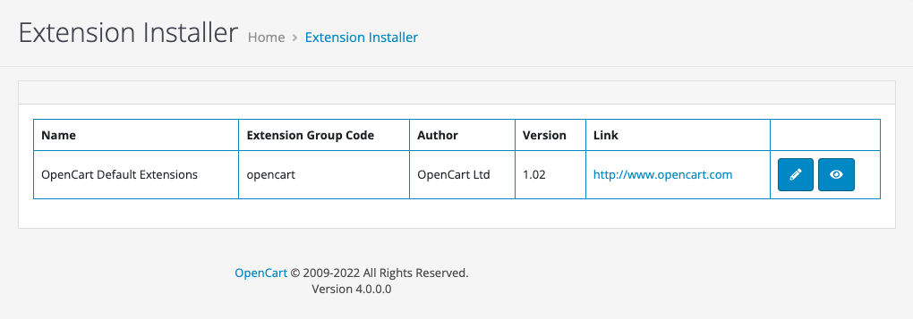
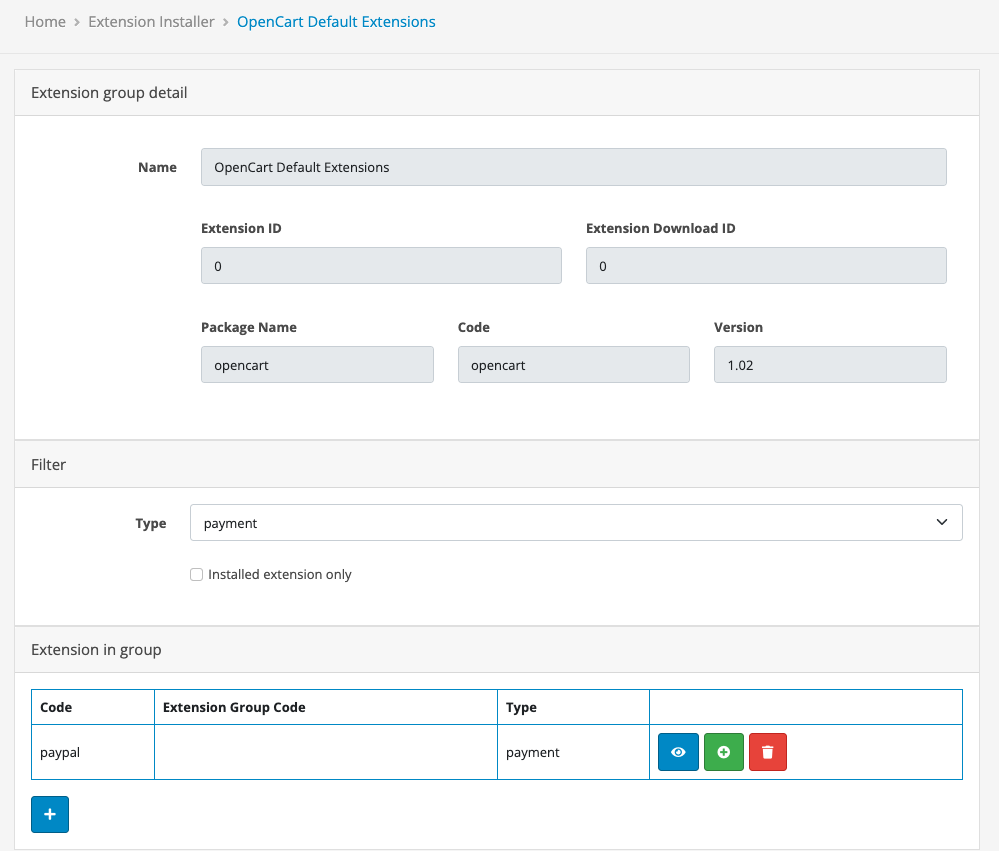
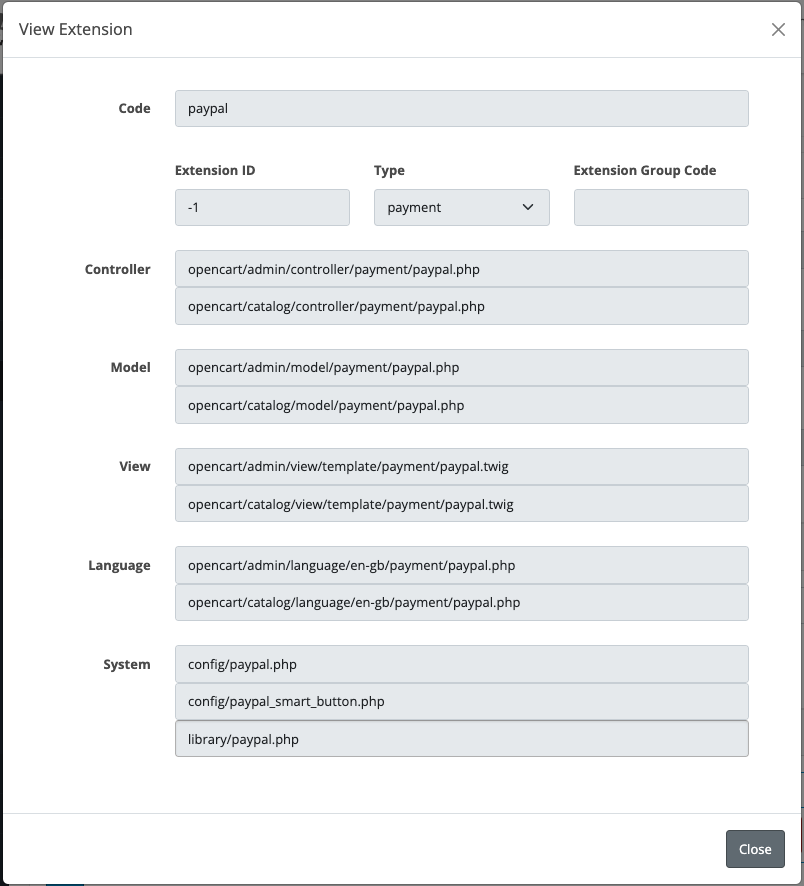
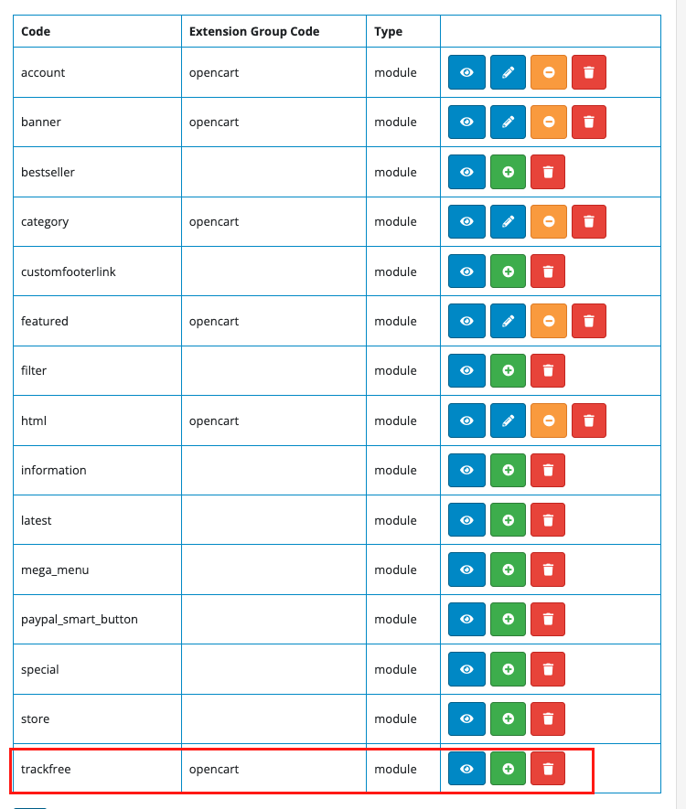
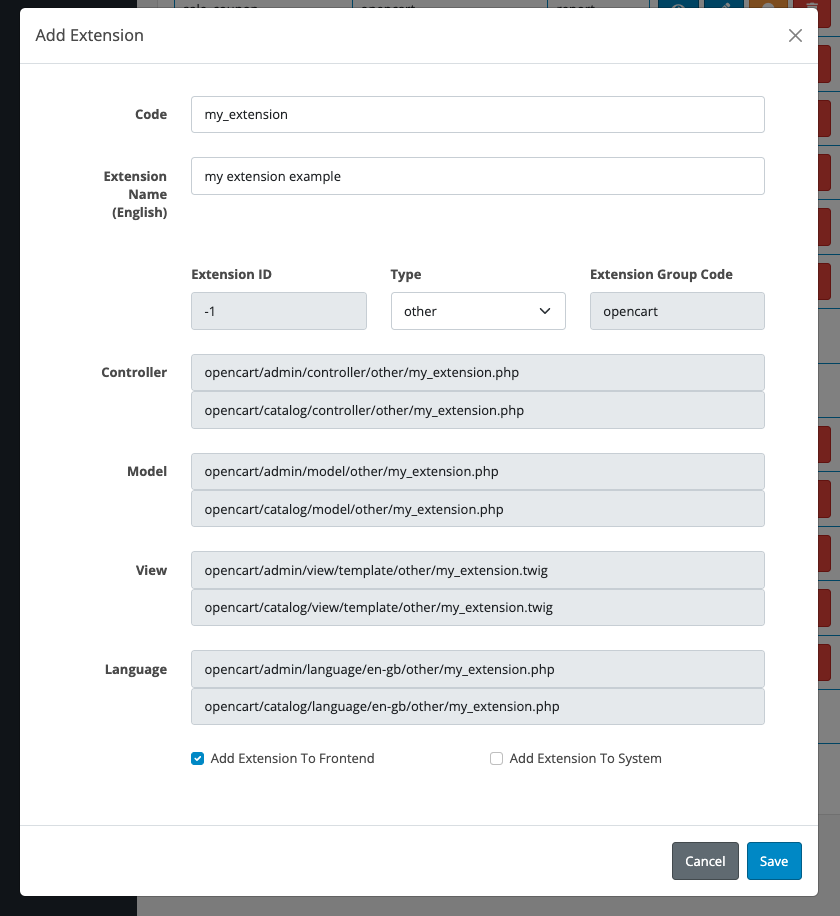

<p align="center">
<a href="https://php.net/"></a>
<a href="https://github.com/opencart/opencart"></a>
</p>

# opencart extension generator


**OC extension generator** is a tool to help admins and developers create, install and remove extensions for **Opencart**. This tool will create a file and set up some basic sourcecode for an **Opencart extension**

This tool supports fixing some errors related to the namespace of extensions downloaded from [OpenCart Extension Store](https://www.opencart.com/index.php?route=marketplace/extension)  that make them impossible to install and use.

> * PHP : 8+
> * Opencart : 4.x.x

## User manual

### Install

`-` clone the whole source from git to your machine

`-` copy and **merge** the **admin, system** folder with your admin folder

### Using

`-` Access the following route : 

**https://your_admin_url/index.php?route=tool/extension**

`-` List installer extensions, currently only one installer is the default installer of opencart. It means that the entire sourcecode of the extension will be located in the directory **your_project_dir/extension/opencart**



`-` Click the view button to go to the <a name="detail-page"></a>**_detail page_**. Here we will see a list of extensions found in the system. You can use the filter by type to find your extension



`-` Click on the view button on each extension and you will see detailed information about the files related to that extension.



### Install new extension

`-` Download new extension from [OpenCart Extension Store](https://www.opencart.com/index.php?route=marketplace/extension) and copy and **merge** the **admin, system** folder with your **extension/opencar** folder. Example I download the **Trackfree** extension.

`-` Visit the [detail page](#detail-page), you will see Trackfree in the list and click 



`-` After install , you can click setting button and go to setting page of plugin.


### Uninstall an extension

`-` Click uninstall to extension

### Remove an extension

Click the remove button to remove the extension, this will uninstall and delete the files related to the extension.

### Remove an extension

`-` Visit the [detail page](#detail-page), you will see add button at bottom.




`-` After clicking the save button, the system will automatically generate the files and basic sourcecode required of an extension and you can see the path to those files by clicking the view button.

`-` Part of the sourcecode is automatically generated :

```php
namespace Opencart\Admin\Controller\Extension\Opencart\Other;
class MyExtension extends \Opencart\System\Engine\Controller {
	public function index(): void {
		$this->load->language('extension/opencart/other/my_extension');
		$this->document->setTitle($this->language->get('heading_title'));
		$this->load->model('extension/opencart/other/my_extension');
		$data['breadcrumbs'] = [];
		$data['breadcrumbs'][] = [
			'text' => $this->language->get('text_home'),
			'href' => $this->url->link('common/dashboard', 'user_token=' . $this->session->data['user_token'])
		];
		$data['breadcrumbs'][] = [
			'text' => $this->language->get('heading_title'),
			'href' => $this->url->link('extension/opencart/other/my_extension', 'user_token=' . $this->session->data['user_token'])
		];
		$data['header'] = $this->load->controller('common/header');
		$data['column_left'] = $this->load->controller('common/column_left');
		$data['footer'] = $this->load->controller('common/footer');

		$this->response->setOutput($this->load->view('extension/opencart/other/my_extension', $data));
	}

	public function install(): void {}
	public function uninstall(): void {}
}
```

# License

`-` **OC extension generator** is released under the MIT license. [See LICENSE](LICENSE) for details.

`-` **OC extension generator** is useful for you? Please consider donating to sustain our activities ? Please consider [donating](https://www.paypal.me/lequang1988) to sustain my activities.
<p align="center">
<a href="https://www.paypal.me/lequang1988"></a>
</p>

